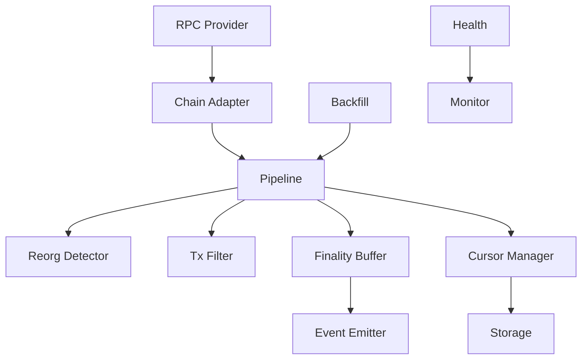

# 🦅 Watcher (Multi-Chain Indexer)

A robust, fault-tolerant, and RPC-efficient blockchain indexer designed for free-tier RPC constraints.

## 🌟 Key Features

*   **Multi-Chain Support**: Native support for EVM and Bitcoin (extensible).
*   **RPC Efficiency**: Optimized to minimize calls (Batched calls, Bloom Filters).
*   **Resiliency**:
    *   **Reorg Handling**: Automatically detects fork depths and rolls back state.
    *   **Recovery**: Exponential backoff for failed blocks.
    *   **Backfill**: Background processor for missing block gaps.
*   **Finality Safety**: Buffer events until customizable finality depth is reached.
*   **Health Monitoring**: Metrics and health checks exposed via HTTP.

## 🏗 Architecture



## 🚀 Getting Started

### Prerequisites
- Go 1.22+

### Installation

```bash
git clone https://github.com/vietddude/watcher.git
cd watcher
go mod download
```

### Configuration

Create a `config.yaml` file:

```yaml
server:
  port: 8080

chains:
  - id: "ethereum"
    type: "evm"
    rpc_url: "https://your-rpc-url"
    finality_blocks: 12
    scan_interval: 12s
```

### Running

```bash
go run cmd/watcher/main.go
# OR if using the library directly
go test ./...
```

## 📦 Packages

- `internal/control`: Application assembly and lifecycle.
- `internal/indexing/indexer`: Core pipeline logic.
- `internal/indexing/reorg`: Safe chain handling.
- `internal/indexing/backfill`: Missing block recovery.
- `internal/core/cursor`: State machine for indexing position.

## 🤝 Contribution

1. Fork it
2. Create your feature branch (`git checkout -b feature/amazing`)
3. Commit changes (`git commit -am 'Add amazing feature'`)
4. Push to branch (`git push origin feature/amazing`)
5. Open a Pull Request
