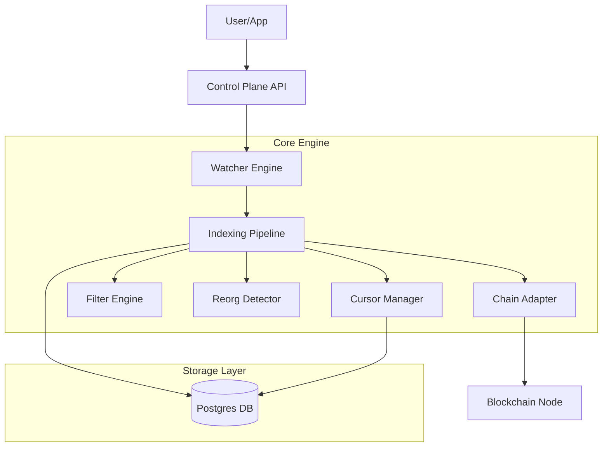
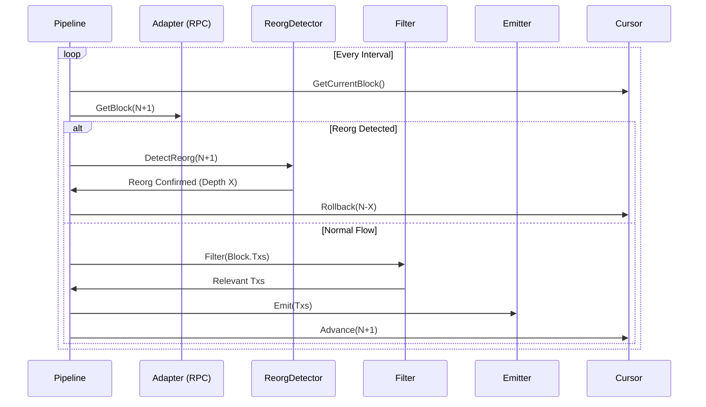

# System Architecture & Data Flows

## 1. High-Level Architecture

The **Watcher** is a modular, event-driven indexing system. It assumes the role of a "Control Plane" orchestrating data flow from blockchains to your application's storage or event bus.

## 2. Component Design

### Control Plane (`internal/control`)
- **Watcher**: Composition root. Wires all dependencies.
- **Health**: Monitored via `health.Monitor`. Exposes HTTP `/health`.

### Indexing Pipeline (`internal/indexing/indexer/pipeline.go`)
The heart of the system. Runs in a loop:
1.  **Fetch**: Get next block via `ChainAdapter`.
2.  **Reorg Check**: Verify parent hash consistency.
3.  **Process**:
    - Extract Transactions.
    - Filter interesting TXs (`Filter`).
    - Emit events (`Emitter`).
4.  **Commit**: Update Cursor (`CursorRepo`).

### Data Models (`internal/core/domain`)
- **Block**: Normalized block header.
- **Transaction**: Normalized tx data.
- **Event**: Derived event (e.g., "Log Found").
- **Cursor**: State checkpoint.

## 3. Data Flow: Indexing

## 4. Failure Recovery

1.  **Transient Failure (RPC Timeout)**:
    - Pipeline retries with **Exponential Backoff**.
2.  **Persistent Failure (Bad Data)**:
    - Block marked as Failed in `failed_blocks` queue.
    - Pipeline skips and continues (if policy allows) or halts.
3.  **Missing Blocks (Gaps)**:
    - `Backfill` process detects gaps in `blocks` table.
    - Queues ranges in `missing_blocks`.
    - Background worker fills gaps.

## 5. Directory Structure

- `cmd/`: Entry points.
- `internal/`: Private library code.
    - `control/`: App assembly.
    - `core/`: Domain types, config, ports.
    - `indexing/`: Logic (Pipeline, Recover, Reorg).
    - `infra/`: Adapters (RPC, Postgres, Memory).
- `migrations/`: SQL schemas.
