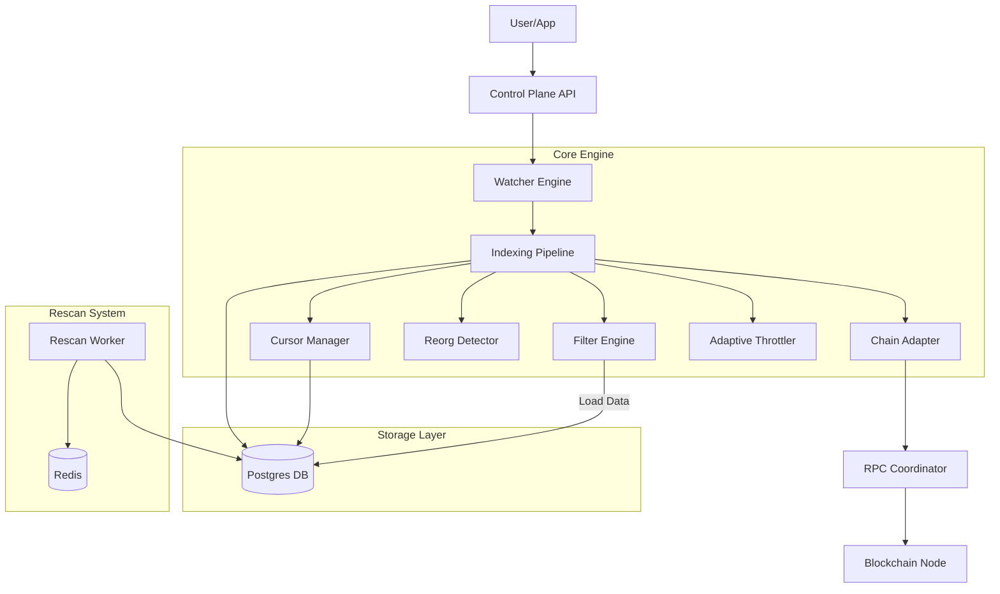

# System Architecture & Data Flows

## 1. High-Level Architecture

The **Watcher** is a modular, event-driven indexing system. It assumes the role of a "Control Plane" orchestrating data flow from blockchains to your application's storage or event bus.

### Simplified Overview

```text
[RPC Providers] → [Watcher] → [PostgreSQL]
                      ↓
                [Prometheus/Grafana]
```

### Detailed Flow



## 2. Component Design

### Control Plane (`internal/control`)
- **Watcher**: Composition root. Wires all dependencies including DB, Redis, and Indexers.
- **Health**: Monitored via `health.Monitor`. Exposes HTTP `/health`.

### Indexing Pipeline (`internal/indexing/indexer/pipeline.go`)
The heart of the system. Runs in a loop:
1.  **Adaptive Wait**: Computes next `ScanInterval` and `BatchSize` based on chain lag via `AdaptiveController`.
2.  **Fetch**: Get next block (or range) via `ChainAdapter`. Supports `BatchAdapter` for multi-block fetching.
3.  **Reorg Check**: Verify parent hash consistency.
4.  **Process**:
    - Extract Transactions.
    - **Filter**: Check against `WalletAddress` Bloom Filter.
    - Emit events (`Emitter`).
5.  **Commit**: Update Cursor (`CursorRepo`) and persist data (`BlockRepo`, `TxRepo`).

### Adaptive Throttling (`internal/indexing/throttle`)
- **AdaptiveController**: Dynamically adjusts polling frequency and batch sizes.
    - **Interval Scaling**: Decreases wait time when lag is high.
    - **Batch Scaling**: Increases blocks-per-request when behind.
- **HeadCache**: Minimizes `eth_blockNumber` calls by caching the chain tip across multiple indexers.

### RPC Management (`internal/infra/rpc`)
- **Coordinator**: Orchestrates operations across providers. Handles proactive rotation when quota is near threshold.
- **Providers (`internal/infra/rpc/provider`)**: Pluggable implementations for HTTP (JSON-RPC) and **gRPC** (Sui).
- **Router (`internal/infra/rpc/routing`)**: Smart routing logic based on health, latency, and budget.
- **Budget (`internal/infra/rpc/budget`)**: Tracks method limitations and daily quotas.
- **Operations**: Abstracted RPC calls enabling unified handling of JSON-RPC and gRPC.
- **Batching**: Support for `BatchAdapter` allows fetching multiple block headers in one roundtrip.

### Data Models (`internal/core/domain`)
- **Block**: Normalized block header.
- **Transaction**: Normalized tx data.
- **WalletAddress**: Monitored addresses for filtering.
- **Cursor**: State checkpoint.
- **Missing/Failed Block**: Recovery queue items.

## 3. Storage Layer

### PostgreSQL
Primary persistence for all indexed data.
- **Schema**: Managed via `goose` migrations.
    - `blocks`: Indexed blocks.
    - `transactions`: Filtered transactions.
    - `cursors`: Indexer progress.
    - `wallet_addresses`: Monitored targets.
    - `missing_blocks`: Backfill queue.
    - `failed_blocks`: Retry queue.
- **Repositories**: `internal/infra/storage/postgres` using **sqlc** for type-safe query generation. Generated code resides in `internal/infra/storage/postgres/sqlc`.

### Redis
Used for coordination of heavy background tasks.
- **Rescan Ranges**: Queue for re-scanning past blocks.
- **Locks**: Distributed locking for workers.

## 4. Wallet Filtering (Bloom Filter)

To optimize storage and processing, the Watcher uses a filtering mechanism:
1.  **Storage**: `wallet_addresses` table stores interested addresses.
2.  **In-Memory**: On startup, addresses are loaded into a `SimpleFilter` (Bloom Filter equivalent).
3.  **Pipeline**: Every transaction is checked against the filter. Only matches are persisted and emitted.

## 5. Failure Recovery

1.  **Transient Failure (RPC Timeout)**:
    - Pipeline retries with **Exponential Backoff**.
2.  **Persistent Failure (Bad Data)**:
    - Block marked as Failed in `failed_blocks` (Postgres).
    - Pipeline continues; background retry mechanism handles remediation.
3.  **Missing Blocks (Gaps)**:
    - `Backfill` process detects gaps in `blocks` table.
    - Queues ranges in `missing_blocks`.
    - Background worker fills gaps.

## 6. Directory Structure

- `cmd/`: Entry points.
- `internal/`: Private library code.
    - `control/`: App assembly.
    - `core/`: Domain types, config, ports.
    - `indexing/`: Logic (Pipeline, Recover, Reorg).
    - `infra/`: Adapters.
        - `rpc/`: RPC Manager (Provider, Routing, Budget).
        - `storage/`: Persistence (Postgres/sqlc, Redis).
        - `chain/`: Chain-specific adapters (EVM, Sui, Tron, Bitcoin).
- `migrations/`: SQL schemas (Goose).
- `docs/`: Architecture and design docs.

## 7. Additional Documentation

- [Monitoring Guide](./monitoring.md) - Metrics and Dashboards.
- [Troubleshooting](./troubleshooting.md) - FAQ and Common Issues.
- [Roadmap](./roadmap.md) - Future features and improvements.
