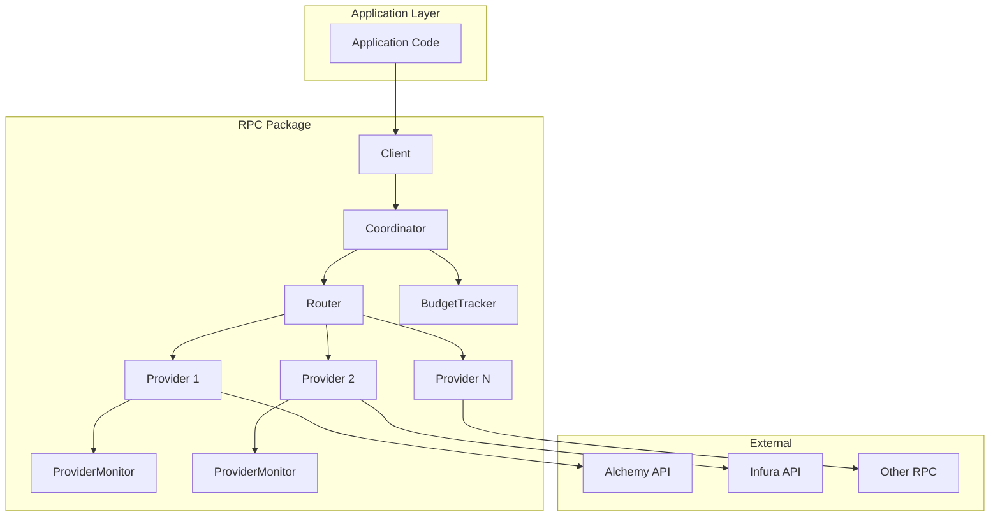

# RPC Package

Production-ready RPC infrastructure for multi-chain blockchain indexers.

## Architecture



## Quick Start

```go
import "github.com/vietddude/watcher/internal/infra/rpc"

// 1. Create providers
alchemy := rpc.NewHTTPProvider("alchemy", os.Getenv("ALCHEMY_URL"), 30*time.Second)
infura := rpc.NewHTTPProvider("infura", os.Getenv("INFURA_URL"), 30*time.Second)

// 2. Setup budget tracker
budget := rpc.NewBudgetTracker(100000, map[string]float64{"ethereum": 1.0})

// 3. Setup router with rotation strategy
router := rpc.NewRouterWithStrategy(budget, rpc.RotationProactive)
router.AddProvider("ethereum", alchemy)
router.AddProvider("ethereum", infura)

// 4. Create coordinator (optional, for advanced features)
coordinator := rpc.NewCoordinator(router, budget)

// 5. Create client
client := rpc.NewClientWithCoordinator("ethereum", coordinator)

// 6. Make calls
result, err := client.Call(ctx, "eth_blockNumber", nil)
```

## Components

| Component | Responsibility |
|-----------|----------------|
| **Client** | Facade for application code. Delegates to Coordinator. |
| **Coordinator** | Orchestrates budget, routing, retry, and failover logic. |
| **Router** | Selects best provider based on health and availability. |
| **BudgetTracker** | Manages quota limits and throttling. |
| **ProviderMonitor** | Tracks latency, errors, and calculates health score. |

## Rotation Strategies

| Strategy | Description |
|----------|-------------|
| `RotationRoundRobin` | Simple sequential rotation. |
| `RotationWeighted` | Based on remaining quota. |
| `RotationAdaptive` | Based on performance + quota. |
| `RotationProactive` | Actively distributes to prevent hitting limits. |

## Prometheus Metrics

| Metric | Type | Labels | Description |
|--------|------|--------|-------------|
| `watcher_rpc_calls_total` | Counter | chain, provider, method | Total RPC calls |
| `watcher_rpc_errors_total` | Counter | chain, provider, error_type | Total RPC errors |
| `watcher_rpc_latency_seconds` | Histogram | chain, provider, method | RPC call latency |
| `watcher_rpc_provider_health_score` | Gauge | chain, provider | Health score (0-100) |
| `watcher_rpc_provider_quota_usage_ratio` | Gauge | chain, provider | Quota usage (0-1) |
| `watcher_rpc_provider_latency_seconds` | Gauge | chain, provider | Average latency |

## Health Score Calculation

The `ProviderMonitor.GetHealthScore()` returns a normalized score (0-100):

- **Status**: Blocked=0, Throttled=-60, Degraded=-30
- **Latency**: >3s=-30, >2s=-20, >1s=-10
- **Usage**: >90%=-30, >75%=-15, >50%=-5
- **Errors**: 429=-3 per error, 403=-8 per error

## Configuration

```go
config := rpc.CoordinatorConfig{
    ProactiveRotation:   true,
    RotationThreshold:   75.0,  // Rotate at 75% usage
    MinRotationInterval: 2 * time.Minute,
}
coordinator := rpc.NewCoordinatorWithConfig(router, budget, config)
```
