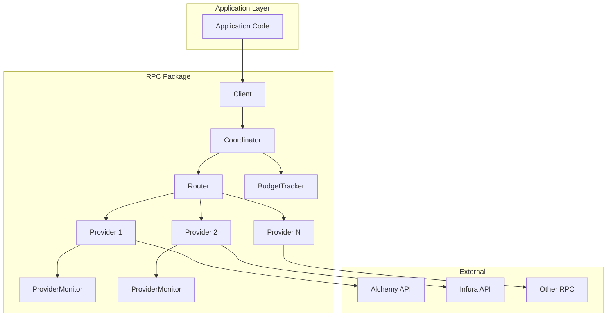

# RPC Package

> ⚠️ **Design Note (IMPORTANT)**
>
> This package is **infra-level code**, not application logic.
> It intentionally handles multiple hard problems at once:
>
> * Multi-provider RPC (Alchemy, Infura, custom nodes)
> * Automatic retry, failover, and rotation
> * Budget / quota tracking
> * Health monitoring
> * Support for **both JSON-RPC and gRPC generated clients**
>
> The size and structure are intentional.
> **Do not refactor or simplify unless absolutely necessary.**


## Architecture



---

## Quick Start (JSON-RPC)

```go
import "github.com/vietddude/watcher/internal/infra/rpc"

// 1. Create providers
alchemy := rpc.NewHTTPProvider("alchemy", os.Getenv("ALCHEMY_URL"), 30*time.Second)
infura := rpc.NewHTTPProvider("infura", os.Getenv("INFURA_URL"), 30*time.Second)

// 2. Setup budget tracker
budget := rpc.NewBudgetTracker(100000, map[string]float64{
    "ethereum": 1.0,
})

// 3. Setup router with rotation strategy
router := rpc.NewRouterWithStrategy(budget, rpc.RotationProactive)
router.AddProvider("ethereum", alchemy)
router.AddProvider("ethereum", infura)

// 4. Create coordinator
coordinator := rpc.NewCoordinator(router, budget)

// 5. Create client
client := rpc.NewClientWithCoordinator("ethereum", coordinator)

// 6. Make calls (legacy JSON-RPC API)
result, err := client.Call(ctx, "eth_blockNumber", nil)
```

> `Call()` is kept for backward compatibility (JSON-RPC only).
> New code should prefer **`Execute()` with `Operation`**.

---

## Operation Model

The `Operation` abstraction allows the coordinator to execute requests across different protocols seamlessly.

### Supported Protocols

1. **JSON-RPC 2.0 (Standard)**
   - Default for Ethereum, Polygon, etc.
   - Use `NewHTTPOperation`.

2. **JSON-RPC 1.0**
   - Required for Bitcoin (strict 1.0 compliance).
   - Use `NewJSONRPC10Operation` (omits version field, handles null params).

3. **REST**
   - Required for Tron.
   - Use `NewRESTOperation` (supports methods, headers, and arbitrary bodies).

4. **gRPC**
   - Required for Sui, Solana, etc.
   - Use `NewGRPCOperation`.
   - **Crucial**: The `GRPCHandler` receives the active connection from the provider, enabling load balancing for generated clients.

---

## Usage Examples

### 1. HTTP JSON-RPC 2.0 (Ethereum)

```go
op := rpc.NewHTTPOperation("eth_blockNumber", nil)
result, err := client.Execute(ctx, op)
```

### 2. HTTP JSON-RPC 1.0 (Bitcoin)

```go
// Helper handles version 1.0 quarks (no jsonrpc field, null params)
op := rpc.NewJSONRPC10Operation("getblockcount")
result, err := client.Execute(ctx, op)
```

### 3. HTTP REST (Tron)

```go
// Execute: POST /wallet/getnowblock
op := rpc.NewRESTOperation("wallet/getnowblock", "POST", nil)
result, err := client.Execute(ctx, op)
```

### 4. gRPC (Sui)

```go
// The handler receives the active 'conn' from the load-balanced provider
op := rpc.NewGRPCOperation("GetCheckpoint", func(ctx context.Context, conn grpc.ClientConnInterface) (any, error) {
    // Create generated client using the injected connection
    cli := suipb.NewLedgerServiceClient(conn)
    return cli.GetCheckpoint(ctx, &req)
})

result, err := client.Execute(ctx, op)
```

---

## Components

| Component           | Responsibility                                         |
| ------------------- | ------------------------------------------------------ |
| **Client**          | Facade for application code                            |
| **Coordinator**     | Orchestrates budget, routing, retry, and failover      |
| **Router**          | Selects best provider based on health and availability |
| **BudgetTracker**   | Manages quota limits and throttling                    |
| **ProviderMonitor** | Tracks latency, errors, and provider health            |

---

## Rotation Strategies

| Strategy             | Description                                   |
| -------------------- | --------------------------------------------- |
| `RotationRoundRobin` | Simple sequential rotation                    |
| `RotationWeighted`   | Based on remaining quota                      |
| `RotationAdaptive`   | Based on performance + quota                  |
| `RotationProactive`  | Actively distributes load to avoid throttling |

---

## Prometheus Metrics

| Metric                                   | Type      | Labels                      | Description          |
| ---------------------------------------- | --------- | --------------------------- | -------------------- |
| `watcher_rpc_calls_total`                | Counter   | chain, provider, method     | Total RPC calls      |
| `watcher_rpc_errors_total`               | Counter   | chain, provider, error_type | Total RPC errors     |
| `watcher_rpc_latency_seconds`            | Histogram | chain, provider, method     | RPC call latency     |
| `watcher_rpc_provider_health_score`      | Gauge     | chain, provider             | Health score (0–100) |
| `watcher_rpc_provider_quota_usage_ratio` | Gauge     | chain, provider             | Quota usage (0–1)    |
| `watcher_rpc_provider_latency_seconds`   | Gauge     | chain, provider             | Average latency      |

---

## Health Score Calculation

`ProviderMonitor.GetHealthScore()` returns a normalized score **0–100**:

* **Status**

  * Blocked: `0`
  * Throttled: `-60`
  * Degraded: `-30`
* **Latency**

  * > 3s: `-30`
  * > 2s: `-20`
  * > 1s: `-10`
* **Usage**

  * > 90%: `-30`
  * > 75%: `-15`
  * > 50%: `-5`
* **Errors**

  * HTTP 429: `-3` per error
  * HTTP 403: `-8` per error

---

## Configuration

```go
config := rpc.CoordinatorConfig{
    ProactiveRotation:   true,
    RotationThreshold:   75.0, // rotate at 75% usage
    MinRotationInterval: 2 * time.Minute,
}

coordinator := rpc.NewCoordinatorWithConfig(router, budget, config)
```

---

### Final Note

This package is designed to be **stable and reused** across:

* blockchain indexers
* watcher jobs
* gRPC-based internal services
* future MPC / wallet infrastructure

If you feel the code looks “large”, that is expected.
**The complexity is intentional and centralized here.**
